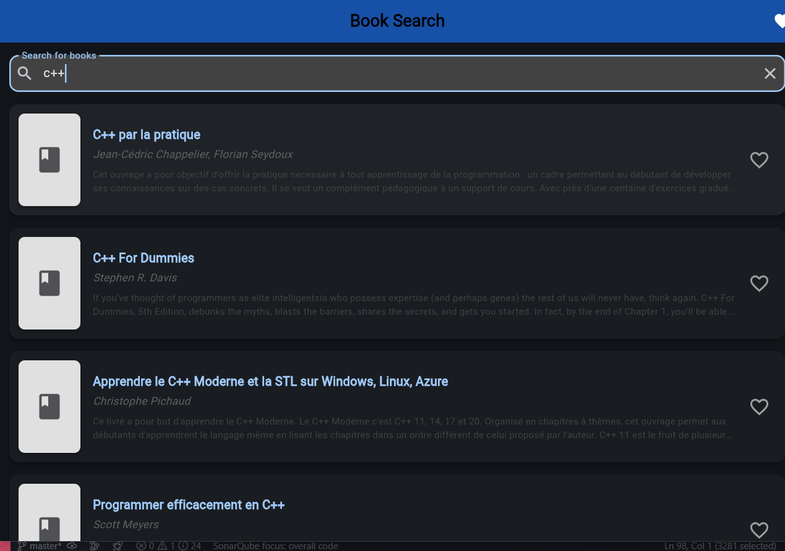

# G-Livres - Book Management App

A Flutter application for searching and managing your favorite books via Google Books API.

## Features

- **Search Books**: Search for a wide variety of books using the Google Books API
- **View Book Details**: See detailed information about each book including authors and descriptions
- **Manage Favorites**: Save your favorite books for offline access
- **Swipe to Delete**: Easily remove books from your favorites with a simple swipe gesture
- **Pull to Refresh**: Update search results or favorites list with a simple pull gesture
- **Image Caching**: Efficiently load and cache book cover images for faster browsing
- **Dark Mode Support**: Beautiful UI in both light and dark modes
- **Web Compatible**: Works seamlessly on mobile devices and web browsers

## Technologies Used

- **Flutter**: Framework for building cross-platform mobile applications
- **SQLite**: Local database for storing favorite books
- **Google Books API**: External API for book information
- **Cached Network Image**: Package for efficient image loading and caching

## Getting Started

1. Clone this repository
2. Run `flutter pub get` to install dependencies
3. Run `flutter run` to start the application on your device or simulator
4. For web deployment, run `flutter build web` and deploy the output in the build/web directory

## Project Structure

The project follows a clean architecture approach with separate directories for:

- **models**: Data structures and object mapping
- **services**: External API interaction and local database management
- **screens**: UI containers and state management
- **widgets**: Reusable UI components

## License

This project is open source and available under the MIT License.
